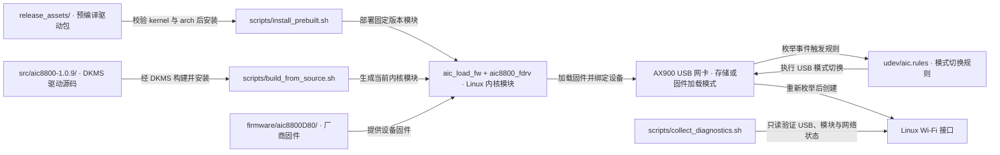

# ugreen-ax900

UGREEN AX900 / AICSemi AIC8800D80 USB Wi-Fi 网卡的 Linux 驱动整理仓库。

工程标准入口：`harness/docs/workspace/standards/linux_driver/linux_driver_golden_path.md`。

## 架构拓扑



本仓库提供两种安装方式：

- 直接安装 release 中的预编译驱动包：只适配已验证的 Ubuntu 24.04 / `6.17.0-14-generic` / `x86_64`。
- 从源码通过 DKMS 构建：适合其他内核版本，但需要本机有内核头文件和编译工具链。

## 已验证硬件与系统

当前 release 的预编译模块来自下面这台机器：

```text
OS      Ubuntu 24.04.4 LTS
Kernel  6.17.0-14-generic
Arch    x86_64
Device  368b:8d85 AICSemi AIC 8800D80
Driver  aic8800_fdrv
```

正常工作时可看到：

```bash
lsusb | grep -Ei '368b|aic'
# Bus 002 Device 005: ID 368b:8d85 AICSemi AIC 8800D80

lsusb -t
# Driver=aic8800_fdrv

nmcli device status
# wlx... wifi disconnected/connected
```

## 方案一：安装预编译 release

这个方案最快，但有硬性边界：

- 只允许安装到 `6.17.0-14-generic`。
- 只允许安装到 `x86_64`。
- Secure Boot 开启时不建议使用预编译包；请改用源码构建并按本机策略签名模块。

步骤：

```bash
tar -xzf ugreen-ax900-prebuilt_ubuntu24.04_kernel6.17.0-14_x86_64_v0.1.0.tar.gz
cd ugreen-ax900-prebuilt
sha256sum -c SHA256SUMS
sudo bash scripts/install_prebuilt.sh
```

安装完成后，物理拔下网卡再插回，优先使用主板后置 USB 口。然后执行：

```bash
bash scripts/collect_diagnostics.sh
```

预期结果：

- `lsusb` 从初始 `a69c:5723` 或 `a69c:8d80` 变为 `368b:8d85`。
- `lsusb -t` 显示 `Driver=aic8800_fdrv`。
- `ip -br link` 或 `nmcli device status` 出现 `wlx...` Wi-Fi 接口。

## 方案二：从源码构建

适用于当前内核不是 `6.17.0-14-generic` 的情况。

先安装依赖：

```bash
sudo apt update
sudo apt install -y dkms build-essential linux-headers-$(uname -r) usb-modeswitch
```

然后构建并安装：

```bash
git clone https://github.com/darren-you/ugreen-ax900.git
cd ugreen-ax900
sudo bash scripts/build_from_source.sh
```

构建脚本会：

- 把 `src/aic8800-1.0.9` 安装到 `/usr/src/aic8800-1.0.9`。
- 通过 DKMS 构建并安装 `aic_load_fw` 和 `aic8800_fdrv`。
- 安装 `firmware/aic8800D80` 到 `/lib/firmware/aic8800D80`。
- 安装 udev 规则和开机模块加载配置。

构建完成后，同样需要物理拔插一次网卡，再执行：

```bash
bash scripts/collect_diagnostics.sh
```

## 常见问题

### 1. 插上后只看到 `a69c:5723 Aic MSC`

这是网卡的虚拟光盘/大容量存储模式，还不是 Wi-Fi 模式。

处理：

```bash
sudo apt install -y usb-modeswitch
sudo usb_modeswitch -KQ -v a69c -p 5723
```

然后拔插网卡。

### 2. 看到 `a69c:8d80`，但没有 `wlan` / `wlx...`

这是固件加载阶段。正常链路应继续重新枚举成 `368b:8d85` 或相近的 `368b:8d8*` 设备，再由 `aic8800_fdrv` 接管。

处理：

```bash
sudo modprobe aic_load_fw
sudo modprobe aic8800_fdrv
```

随后物理拔插网卡。Z420 上验证过，软件 reset、USB 端口 unbind/bind、EHCI 控制器 reset 都不如物理拔插可靠。

### 3. `dkms build` 失败

先检查内核头文件：

```bash
uname -r
ls -ld /lib/modules/$(uname -r)/build
```

如果缺失：

```bash
sudo apt install -y linux-headers-$(uname -r)
```

如果 `apt` 被本地代理或 fake-ip 影响，先修复系统网络解析，不要把不完整的包状态继续扩大。

### 4. Secure Boot 开启

预编译包不会使用你的本机 MOK 签名。Secure Boot 开启时，请使用源码构建，并按本机安全策略签名内核模块或关闭 Secure Boot。

### 5. `ethtool -i wlx...` 显示 `driver: usb`

这个驱动的 `ethtool` 信息不太可靠。以这两个结果为准：

```bash
lsusb -t
lsmod | grep aic
```

只要看到 `Driver=aic8800_fdrv`，并且 `aic8800_fdrv`、`aic_load_fw` 已加载，就说明驱动绑定正确。

### 6. 升级内核后 Wi-Fi 消失

预编译包只适配固定内核。升级内核后执行源码构建：

```bash
sudo bash scripts/build_from_source.sh
```

## 仓库结构

```text
src/aic8800-1.0.9/       AIC8800 DKMS 源码
firmware/aic8800D80/     AIC8800D80 固件
udev/aic.rules           存储模式自动 eject 规则
scripts/                 安装、构建和诊断脚本
```

## 许可证与来源

发布包由 `scripts/package_release.sh` 生成；交付前核对 `VERSION`、包内兼容元数据、文件清单、校验值、许可证与安装脚本。安装前后用 `scripts/collect_diagnostics.sh` 对照目标系统、架构、内核、Secure Boot、模块加载和网卡绑定；DKMS 路径还需在目标机验证重启加载与内核升级后的重建。

驱动源码来自 AICSemi/BrosTrend AIC8800 驱动包，保留原始版权和许可证声明。本仓库新增脚本与文档按 `LICENSE` 中的说明发布。固件是厂商二进制固件，见 `NOTICE.md`。
